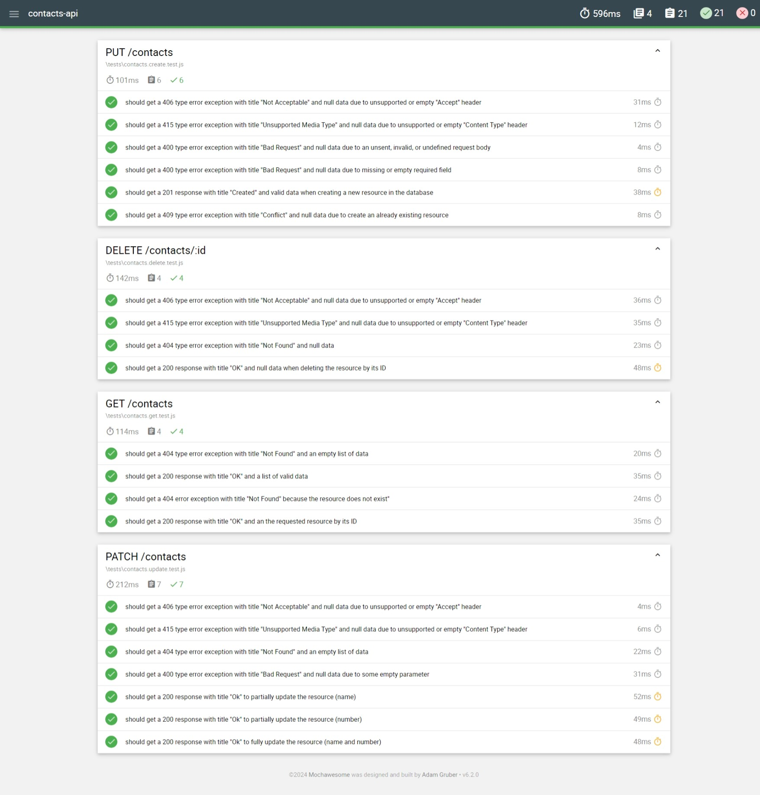

# Management Contacts API
Express application to manage contacts with SQLite database

## Development setup

```bash
git clone https://github.com/soycmramos/management-contacts-api.git
```

```bash
cd management-contacts-api
```

```bash
yarn install
```

```bash
yarn dev
```

Go to http://localhost:5000/api-docs to see the signature documentation

## Testing

```bash
yarn test
```

Open ./mochawesome-report/mochawesome.html in browser


